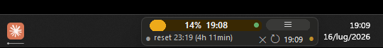
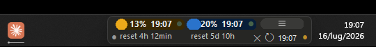
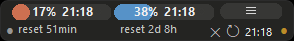
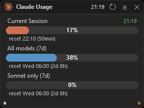
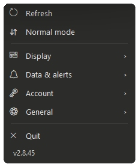

# Claude Usage Widget for Windows

> **Track your Claude.ai usage limits in real time from a tiny widget that sits in an empty spot of your Windows 11 taskbar.** Free, open source, no telemetry.

[](https://opensource.org/licenses/MIT)
[](https://github.com/niccolo-sabato/claude-usage-widget/releases/latest)
[](https://github.com/niccolo-sabato/claude-usage-widget/releases/latest)
[](https://github.com/niccolo-sabato/claude-usage-widget/releases)





*A thin bar that drops into a free spot of your taskbar and shows your Claude usage at a glance, without stealing a single pixel from the windows you actually work in. Show one bar for the smallest footprint, or two or three side by side.*

A lightweight desktop tool that shows your **Claude.ai session limit, weekly limit and Sonnet limit** as live progress bars so you never get cut off mid-conversation. It is **designed to sit on a free spot of the Windows 11 taskbar** in its compact **essential mode**: low profile, never overflows the screen, never blocks your work. The position you choose is remembered across restarts, so once you place it you never have to touch it again.

## Features at a glance

- **Lives on the taskbar** in a compact essential mode, or as a full window when you want the detail
- **Three live usage bars:** session (5h), weekly (7d) and the per-model weekly limit, each with a reset countdown
- **Pick the bars you want:** show one, two or three at once, side by side or stacked; the same choice applies to both modes
- **Multiple accounts:** save several Claude logins, switch instantly, each with its own name and colour
- **Bar colours your way:** a fixed colour per bar (with an in-app picker), or a dynamic palette that tracks the usage level
- **Refresh countdown** shown as a quiet pulsing dot or as a numeric value, your choice
- **Threshold toast notifications** when session usage crosses 25 / 50 / 75 / 90 / 95 / 100 %
- **Win11 taskbar progress overlay** under the app icon, colour-coded by usage
- **Always on top, never steals focus,** position remembered across restarts and updates
- **One-click setup** with the companion browser extension, or a manual fallback
- **Auto-update** from GitHub, **three languages** (EN / IT / JA), **no telemetry**

## Why this widget

If you use **Claude.ai** for hours every day (developers on Claude Code, writers, researchers, students), you have probably hit the dreaded *"You've reached your usage limit"* message at the worst possible moment. Anthropic does not surface your usage anywhere while you work: you have to dig into a settings page.

This widget keeps that information one glance away:

- **Session bar (5 hours):** how much of the rolling 5-hour window you have burned
- **Weekly bar (7 days):** how much of your weekly quota you have used across all models
- **Per-model bar (7 days):** the weekly limit for the model Claude.ai scopes it to; the bar is labelled with that model's name
- **Reset countdown:** exactly when each bar refreshes (`reset 22:10 (52min)`)

Each bar has its own fixed colour so you can tell them apart at a glance, and you can change any of them from a built-in colour picker. Prefer a colour that tracks urgency instead? Switch on the **dynamic** palette and every bar is coloured by its usage level: blue when low, amber in the middle, red when high.

## Built to live on the Windows 11 taskbar

This is the feature that sets the widget apart. In **essential mode** it collapses to a single thin bar that fits right into the empty stretch of the taskbar, next to the clock or your pinned icons. You see your usage all the time, and it never gets in the way.

- **Sized for an empty spot of the taskbar.** Switch to essential mode (right-click the bar, or double-click the orange corner dot) and the widget shrinks to a low-profile strip that sits above the taskbar without spilling onto the desktop.
- **Stays out of the way of every other window.** The widget is a floating tool, hidden by default from the taskbar button list and from Win+Tab, so it never steals focus and never appears in the alt-tab rotation. It uses Win32 `WS_EX_NOACTIVATE`, so clicking the widget never moves your foreground window.
- **Always on top, even over the taskbar.** Topmost is re-asserted continuously, plus on focus and visibility events, so it never slips behind another app or the taskbar's own panel.
- **Position is always saved.** Drag it once to wherever you want it (above the taskbar, on a second monitor, in a corner) and it stays there across restarts, refreshes and updates. Auto-saved on every successful refresh as a backstop against force-kills.
- **Survives monitor changes.** If you unplug a monitor, dock, or rearrange your displays, the widget stays on screen instead of vanishing, and returns to its spot when the original monitor comes back.
- **Smooth expand / collapse.** The optional extra bars grow **upward**, never down, so the widget's bottom edge stays anchored exactly where you placed it.

## A compact display, set up your way

Essential mode is flexible. Show just the session bar for the smallest footprint, or put two or three bars **side by side on a single row** so you can watch session, weekly and Sonnet usage at the same time without ever expanding the widget.



- **Pick the bars you want.** The **Bars to show** menu lets you choose which bars appear (any of session, weekly and the per-model bar; at least one is always shown). Bar widths adapt automatically and the window widens only as much as needed, growing to the left so the menu button stays put.
- **Hamburger menu** on the multi-bar row: a small button opens the settings menu and keeps the reset labels clear of the bottom-right controls.
- **Reduced reset labels** under every bar (`reset 51min`, `reset 2d 8h`) so you always know when each one refreshes, even in the tightest layout.
- **Refresh countdown, your way.** The time to the next data refresh is shown as a quiet pulsing dot on the session bar (default), or as a numeric value if you switch **Countdown** to **Numeric**. A **Sync time** toggle shows or hides the timestamp of the last update.

## A full view when you want the detail

Want a proper window? Double-click the orange corner dot (or pick **Normal mode** from the menu) and the widget becomes a standard window with a title bar, section labels and reset times. It stacks the same bars you selected, so your choice carries across both modes.



Switch back to essential mode the same way. Whichever mode you choose is remembered, and the window always grows upward so it never jumps away from its taskbar spot.

## Download

[**Download latest release**](https://github.com/niccolo-sabato/claude-usage-widget/releases/latest) - one-click installer (~15 MB)

| | |
|---|---|
| **Platform** | Windows 10 (1809+) and Windows 11, x64 |
| **Install size** | ~50 MB on disk |
| **Auto-update** | Yes, in-app via GitHub Releases |
| **Telemetry** | None |
| **Source** | 100 % open source ([widget.pyw](src/widget.pyw)) |

## Setup in under a minute

1. **Install** `ClaudeUsage-Setup.exe` and launch the widget.
2. **Install the [Claude Session Key](https://chromewebstore.google.com/detail/claude-session-key/ppofmhjkjfinjpidlidepeonimpjmadj) extension** (Chrome / Edge / Brave / any Chromium browser).
3. Open Claude.ai, click the extension icon, click **Copy to Clipboard**.
4. Paste the key into the widget's setup dialog. Done.

The widget connects to Claude.ai using the same browser session you are already logged into. No API key, no password, no OAuth.

> **Don't want to install the extension?** The setup guide built into the widget shows how to grab the session key manually from your browser settings or DevTools. Two extra clicks.

## Features

### Live monitoring
- Three usage bars with reset times and a live countdown to the next refresh
- Auto refresh every 3 minutes by default, configurable from 10 seconds to 1 hour
- Instant refresh when a reset time is reached, no waiting for the next tick
- **Threshold notifications**: native Windows toast when session usage crosses 25 / 50 / 75 / 90 / 95 / 100 %, so you know you are approaching the limit even when focused on another window. Toggle on/off from the menu.
- **Optional Win11 taskbar progress overlay** under the app icon: fill width tracks session usage, colour escalates from accent (0-74 %) to yellow (75-89 %) to red (90 % +). The same overlay Edge or Explorer paint during a download.

### Display
- **Essential mode** for the taskbar: compact, no title bar, one or several bars side by side, all controls condensed at the bottom right
- **Standard mode** for desktop placement: full title bar, the selected bars stacked with labels and section dividers
- **Bars to show** picker: choose which bars appear; the same choice drives both modes
- **Bar colours**: a fixed colour per bar chosen from an in-app picker (four presets plus a full colour wheel), or a dynamic palette that colours every bar by its usage level
- **Countdown as a pulsing green dot** (default) or as a numeric value, your choice
- **Sync time** display toggle for the last-update timestamp
- Native Windows 11 design language: DWM rounded corners, translucent background, anti-aliased pill buttons rendered with a 4x supersample
- DPI-aware: tested at 100 %, 125 %, 150 %, 175 % and 200 % scaling; dialogs auto-size so nothing is clipped on high-DPI displays

### Accounts
- **Save multiple Claude logins** and switch between them instantly; the widget refreshes to the selected account right away
- Each account shows its **name, email and plan**, with a coloured avatar; add, rename or remove them from the Account panel
- The active account's session key is edited per account, so you always know which login you are updating

### Authentication and setup
- Companion **[Claude Session Key](https://chromewebstore.google.com/detail/claude-session-key/ppofmhjkjfinjpidlidepeonimpjmadj) extension** copies your session key with one click; works on Chrome, Edge, Brave and any Chromium browser
- Built-in setup guide with manual fallback (browser settings or DevTools) if you would rather not install the extension
- **Multiple accounts**: save more than one Claude login and switch between them in a click; each keeps its own session key, name, email and plan
- **Multi-organization support**: if an account belongs to more than one Claude org (personal + work), the widget uses `/api/bootstrap` to track the org Claude.ai itself routes to, not just the first one in the API response

### Localization
- Three languages: **English, Italian (Italiano), Japanese (日本語)**
- The installer auto-selects the language matching your Windows system language

### Updates and maintenance
- Auto-update from GitHub releases with a single click: the new installer is downloaded, run silently, and the widget relaunches itself
- Single-instance enforcement: launching the executable twice just brings the running widget to the front
- Crash-resilient: structured logs in `%LOCALAPPDATA%\Claude Usage\widget.log`, separate `crash.log` capped at 256 KB, geometry auto-saved every refresh

### Privacy
- The widget sends data **only** to `claude.ai/api/organizations/*/usage`, the exact endpoint Claude.ai itself uses
- No analytics, no telemetry, no third-party services, no phoning home
- Session key stored locally in `%LOCALAPPDATA%\Claude Usage\config.json`
- 100 % open source: every line of code is auditable

## Controls

### Title bar (standard mode)
| Element | Action |
|---|---|
| Claude icon + "Claude Usage" | Drag to move |
| Current time | System clock (HH:MM) |
| ↻ | Force immediate refresh |
| ≡ | Settings menu |
| ✕ | Quit (saves geometry) |

### Corner dots and hamburger
| Control | Gesture | Action |
|---|---|---|
| White dot (left, essential mode) | Click | Expand the compact row into the full stacked view |
| Orange dot (right) | Drag horizontal | Resize widget width |
| Orange dot (right) | Double-click | Toggle essential / standard mode |
| ☰ (essential mode) | Click | Open the settings menu |

### Settings menu

Open it with **≡**, the **☰** button, or by right-clicking the bar in essential mode. Quick actions sit at the top; the rest is grouped into categories that open in a side panel.



- **Refresh** and the **Normal / Essential** mode toggle (top level)
- **Display**: countdown as a pulsing dot or a numeric value, the sync-time timestamp on/off, fixed or dynamic bar colours, and which bars to show (each with a colour swatch). Hover any option for a short explanation.
- **Data & alerts**: refresh interval (10 to 3600 s), threshold notifications, taskbar icon and Win11 progress overlay
- **Account**: manage your accounts (add, switch, rename, remove, update each session key), open the Claude.ai usage page
- **General**: language (EN / IT / JA), check for updates, open the GitHub repo, open `config.json`
- **Quit** (top level)

## Configuration

The widget manages its own config at `%LOCALAPPDATA%\Claude Usage\config.json`. Most users never need to edit it. Notable options:

```jsonc
{
  "accounts": [ /* saved logins, managed from the Account panel */ ],
  "active_account": "…",                 // id of the selected account
  "language": "en",                      // "en" | "it" | "ja"
  "refresh_ms": 180000,                  // auto-refresh cadence
  "countdown_display": "dot",            // "dot" (pulsing) | "full" (numeric)
  "show_sync_time": true,                // show the last-update timestamp
  "essential_bars": ["session"],         // bars to show, in both modes
  "bar_dynamic": false,                  // colour bars by usage level instead of per bar
  "bar_colors": {},                      // per-bar colour overrides from the picker
  "always_check_updates": false,         // skip the 24h update-check throttle
  "debug_tk_scaling": null               // simulate higher DPI for layout testing
}
```

## Build from source

Requirements: Python 3.11+, [PyInstaller](https://pyinstaller.org/), [Inno Setup 6+](https://jrsoftware.org/isdl.php), [Pillow](https://python-pillow.org/). Curl ships with Windows 10/11.

```powershell
.\scripts\build.ps1
```

Output: `releases/ClaudeUsage-Setup.exe`. The script handles PyInstaller, copies the guide, runs Inno Setup, and zips the Chrome extension.

The widget is a single-file Python source (`src/widget.pyw`) using tkinter for the UI, Pillow for the anti-aliased dot and pill rendering, plus Win32 ctypes calls for taskbar integration (`ITaskbarList3` for the progress overlay, `DwmSetWindowAttribute` for rounded corners, `Shell_NotifyIcon` for toast notifications).

## Known behaviors

- **Windows 10:** square corners (DWM rounded corners require Windows 11)
- **Session expiry:** Claude.ai session keys typically last about 30 days or until you log out. The widget shows a clear notice when this happens; update the key from **≡ > Account**
- **TLS via curl:** the widget uses bundled `curl` (schannel + Windows CA store) instead of Python's `urllib`, because Cloudflare in front of claude.ai fingerprints the TLS handshake (JA3) and blocks Python's OpenSSL stack

## Contributing

This is a personal project shared because it might be useful to others. Bugs, feature requests and pull requests are welcome via [GitHub Issues](https://github.com/niccolo-sabato/claude-usage-widget/issues).

If the widget saves you a frustrating mid-conversation cut-off, a star on the repo is the best thank-you.

## Disclaimer

This widget reads usage data from `claude.ai/api/organizations/{id}/usage`, the same internal endpoint Claude.ai uses to render the usage page in your browser. The endpoint may change without notice. The project is not affiliated with or endorsed by Anthropic.

## License

MIT License © 2026 Niccolò Sabato. See [LICENSE](LICENSE).

---

**Keywords:** Claude usage widget Windows, Claude usage bar, Claude usage toolbar, Claude.ai usage tracker Windows, Claude limits monitor, Claude desktop widget, Claude session limit tracker, Claude weekly limit, always-on-top Claude widget, Windows 11 taskbar Claude tool, Claude Code usage monitor, Anthropic Claude usage bar Windows.
