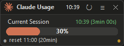
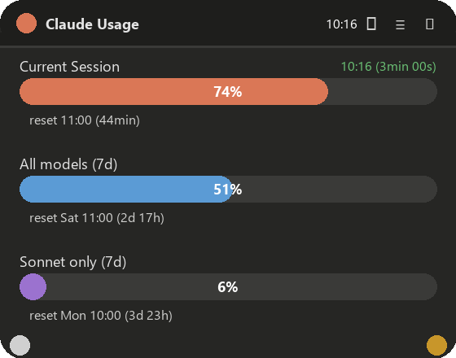
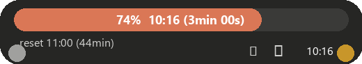
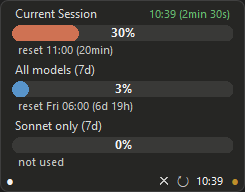
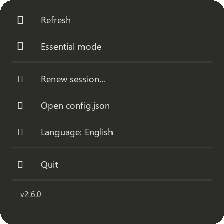

# Claude Usage Widget

A floating always-on-top desktop widget for Windows that displays real-time **Claude.ai** usage statistics. Built with Python + tkinter, styled in the Windows 11 Material design language: rounded corners, translucent background, pill-shaped progress bars.

**Version:** 2.8.26 · **Platform:** Windows 10/11 · **License:** MIT

> 💡 **Tip:** the widget is designed to sit on top of the Windows taskbar in **Essential mode** for always-visible usage monitoring. See [Recommended placement](#recommended-placement).

---

## Features at a glance

- **Three live usage bars**: current 5-hour session, 7-day all models, 7-day Sonnet-only
- **Auto-refresh every 3 minutes** with live countdown timer
- **Instant refresh** when a reset time is reached
- **Auto-update** from GitHub releases with one click (no reinstall needed)
- **Two display modes**: standard (full) and essential (compact, single bar)
- **Drag-to-move** and **drag-to-resize** from the orange corner dot
- **Always above the taskbar** - including after virtual desktop switch
- **Multi-language UI**: English, Italian, Japanese
- **Smooth animations** for expand/collapse with no visual artifacts
- **Single instance enforcement** - second launch brings existing to front
- **Crash protection** with structured logging + self-heal
- **Persistent geometry** - remembers position, size, and mode across restarts
- **Hidden from taskbar & Win+Tab** (floating widget, not a window)

---

## Usage statistics shown

| Metric | Description |
|---|---|
| **Current Session** | 5-hour rolling session window (most relevant during active work) |
| **All models (7d)** | 7-day aggregate across all Claude models |
| **Sonnet only (7d)** | 7-day Sonnet-specific usage (tracked separately by Anthropic) |

Each bar is color-coded:
- 🟧 Accent (Claude orange / blue / purple) under 75%
- 🟨 Orange at 75-89% - warning zone
- 🟥 Red at 90%+ - about to hit limit

Under each bar: `reset 18:00 (3h 26min)` - shows when the limit refreshes.

---

## Install

### End users (recommended)

1. Download `ClaudeUsage-Setup.exe` from the [Releases page](https://github.com/niccolo-sabato/claude-usage-widget/releases)
2. Run the installer (the setup language matches your Windows system language)
3. At first launch, paste your Claude.ai **sessionKey** (see [First-time setup](#first-time-setup))

The installer:
- Installs to `C:\Program Files\Claude Usage\`
- Stores config/logs in `%LOCALAPPDATA%\Claude Usage\`
- Creates Desktop and Start Menu shortcuts
- Adds an entry to "Add/Remove Programs"
- Works on Windows 10 (1809+) and Windows 11

### Chrome companion extension (optional)

The **Claude Session Key** Chrome extension lets you copy the sessionKey with one click instead of digging into DevTools. Available in the `extension/` folder of this repo - pending publication on the Chrome Web Store.

---

## First-time setup

1. Launch the widget - the **Setup dialog** opens automatically
2. Click **"Open guide in browser"** → detailed step-by-step visual guide
3. Paste the `sessionKey` into the widget
4. Click **Connect** - the widget auto-detects your `org_id` and starts monitoring

Your `sessionKey` is a cookie Claude.ai uses to authenticate you. The widget reads usage data with the same session you're logged in with in your browser - no API key, no password, no OAuth.

---

## Recommended placement

The widget is designed to sit **on top of the Windows taskbar**. This is the recommended placement:

- Drag the widget to the bottom of the screen so its lower edge touches the taskbar
- Enable **Essential mode** (double-click the orange dot) for a compact view that fits above taskbar icons
- The widget stays above the taskbar even when switching virtual desktops (forced topmost every 500ms)
- Expand/collapse actions always grow **upward**, so the bottom edge stays locked in place

You can also place it anywhere else on screen (corner, secondary monitor, etc.) - position and size are remembered across restarts.

---

## Controls

### Title bar (standard mode)

| Element | Action |
|---|---|
| Claude icon + "Claude Usage" | Drag to move the widget |
| Current time (HH:MM) | Shows system clock |
| **↻ Refresh** | Force immediate refresh |
| **≡ Menu** | Opens settings dropdown |
| **✕ Close** | Quit the widget (saves geometry) |

### Corner dots

The two dots in the bottom corners control mode and size:

| Dot | Action | Gesture |
|---|---|---|
| **⚪ White (bottom-left)** | Expand/collapse extra bars | **Single click** |
| **🟠 Orange (bottom-right)** | Resize widget width | **Drag** |
| **🟠 Orange (bottom-right)** | Toggle **Essential mode** ↔ Standard | **Double-click** |

**Important:** The orange dot does double duty:
- **Click and drag** horizontally → resize the widget
- **Double-click** → toggle essential mode

Height is always auto-sized to content - you only control width.

### Settings menu (≡)

| Item | Action |
|---|---|
| ↻ **Refresh** | Force immediate data refresh |
| ⇅ **Normal / Essential mode** | Toggle between the two display modes |
| ⏳ **Refresh interval…** | Set auto-refresh interval (10-3600 seconds) |
| 🗝 **Session key…** | Update the sessionKey (when it expires) |
| ↗ **Go to Claude Usage** | Open the Claude.ai usage page in your browser |
| { } **Open config.json** | Open config file in Notepad |
| 🌐 **Language** | Switch UI language (EN / IT / JA) |
| ⬆ **Check for updates…** | Check GitHub for a newer version |
| ✕ **Quit** | Close the widget |
| *v2.8.26* | Current version (non-clickable) |

**In essential mode:** right-click anywhere on the widget to open the menu.

---

## Display modes

### Standard mode (full)

Shows the title bar, all three bars with labels, reset times, and section dividers. Click the white dot to toggle between single-bar and three-bar view - all expansions happen **upward** to keep the bottom edge anchored (ideal when placed on the taskbar).

### Essential mode (compact)

Minimal UI optimized for the taskbar:
- No title bar
- Single bar showing: `55% 19:24 (3min 00s)` - percentage + last refresh time + countdown
- Compact controls at bottom-right: **✕** close, **↻** refresh, current time
- Reset time text underneath the bar

Toggle with **double-click on the orange dot**.

---

## Auto-refresh and countdown

- **Default interval:** 3 minutes (180 seconds); configurable from the ≡ menu (10 – 3600 s)
- **Countdown display:** `19:24 (2min 30s)` after the last refresh time
- **Countdown cadence:**
  - Every 30 seconds above 1 minute
  - Every 10 seconds between 60 s and 30 s (ticks at 60, 50, 40)
  - Every 1 second in the final 30 seconds
- **Reset trigger:** if a reset time is reached, the widget refreshes instantly regardless of the countdown

---

## Updates

The widget checks GitHub for new releases automatically (at most once every 24 hours, silently in the background). When a newer version is published:

1. An orange banner appears at the top of the widget: **"Update available: v2.X.Y"**
2. Click **Update** → dialog opens with the changelog and a one-click installer download
3. The widget downloads `ClaudeUsage-Setup.exe`, launches it, and exits
4. The installer replaces the files in place (your config/position/language are preserved)

The banner also offers **Later** (dismiss for this session) and **Skip** (never remind again for this specific version). You can run the check manually at any time from **≡ → Check for updates…**.

To disable automatic checks entirely, set `"update_check_enabled": false` in `config.json`. To bypass the 24h throttle and re-check on every launch, set `"always_check_updates": true` (useful during development).

---

## Language support

Three languages built-in, selectable from the ≡ menu:

- 🇬🇧 **English** (default for new installs)
- 🇮🇹 **Italiano**
- 🇯🇵 **日本語**

The selected language is saved in `config.json` and persists across restarts. The **installer** also supports these three languages and auto-selects based on your Windows system language.

---

## Technical features

### Always on top

Uses Win32 `SetWindowPos(HWND_TOPMOST)` re-asserted every 500ms, plus `FocusOut` and `Visibility` event handlers. The widget stays above the taskbar even after virtual desktop switches.

### Hidden from taskbar & Win+Tab

Uses `WS_EX_TOOLWINDOW` extended style to hide from the taskbar and the Win+Tab switcher - it's a pure floating widget, not a window.

### Single instance

A Windows named mutex (`Global\ClaudeUsageWidget`) ensures only one instance runs at a time. Launching it again brings the existing widget to the foreground.

### Crash protection

- Global `sys.excepthook` + signal handlers catch all errors
- Structured logs in `%LOCALAPPDATA%\Claude Usage\widget.log`
- Auto-save geometry on every refresh (protects against force-kills)
- Refresh schedule continues even if a single fetch fails

### DWM rounded corners

Uses `DwmSetWindowAttribute` with `DWMWA_WINDOW_CORNER_PREFERENCE` (Windows 11 only). Windows 10 uses square corners.

### Smooth animations

Expand/collapse uses a cover-overlay technique: the window resizes smoothly upward while a frame of the background color hides any unpainted areas, then vanishes when the animation completes. Result: zero flicker, zero artifacts.

---

## Configuration

Config file: `%LOCALAPPDATA%\Claude Usage\config.json`

```json
{
  "session_key": "sk-ant-sid01-...",
  "org_id": "35e32db5-a5be-4592-b287-bcc9e4f12768",
  "language": "en",
  "refresh_ms": 180000,
  "x": 100,
  "y": 100,
  "width": 280,
  "height": 90,
  "expanded": false,
  "essential": false,
  "update_check_enabled": true,
  "always_check_updates": false,
  "last_update_check": 1744934400,
  "skip_version": ""
}
```

All fields are managed by the widget - you don't normally edit this file. See [docs/CONFIGURATION.md](docs/CONFIGURATION.md) for details.

---

## Project structure

```
claude-usage-widget/
├── src/
│   ├── widget.pyw              # Main source (1500+ lines, single file)
│   └── assets/                 # Runtime icons (claude.ico, icon-bar.png)
├── extension/                  # Chrome extension (copy sessionKey with one click)
├── guide/
│   └── session-key-guide.html  # Browser-based setup guide
├── installer/
│   ├── claude-usage-setup.iss  # Inno Setup script
│   └── chrome-store-assets/    # Promo images for Chrome Web Store
├── scripts/
│   ├── build.ps1               # PyInstaller + Inno Setup build
│   └── package-extension.ps1   # ZIP the extension folder
├── docs/                       # Detailed documentation
│   ├── ARCHITECTURE.md
│   ├── DESIGN.md
│   ├── FEATURES.md
│   ├── CONFIGURATION.md
│   └── CHANGELOG.md
├── releases/                   # Built artifacts (gitignored)
└── README.md                   # This file
```

---

## Build from source

### Prerequisites

- **Python 3.11+** with `pip`
- **PyInstaller:** `pip install pyinstaller`
- **Inno Setup 6+** (for the installer): https://jrsoftware.org/isdl.php
- **curl** (ships with Windows 10/11)

### Build steps

```powershell
# Build the exe + installer
.\scripts\build.ps1
```

Output: `releases/ClaudeUsage-Setup.exe` (~12 MB)

Or manually:

```powershell
# 1. Build with PyInstaller
python -m PyInstaller --onedir --noconsole `
    --name "Claude Usage" `
    --icon src/assets/claude.ico `
    --add-data "src/assets/icon-bar.png;." `
    --add-data "src/assets/claude.ico;." `
    --distpath dist --workpath build `
    src/widget.pyw --noconfirm

# 2. Build the installer
& "$env:LOCALAPPDATA\Programs\Inno Setup 6\ISCC.exe" installer/claude-usage-setup.iss
```

---

## Architecture overview

The widget is a **single Python file** (`src/widget.pyw`, ~1500 lines) with these main components:

- **`Section` class** - one usage bar with canvas-based pill rendering
- **`Widget` class** - main window, menu, dialogs, animations, lifecycle
- **`fetch_usage` / `fetch_org_id`** - HTTP calls via curl subprocess
- **`LANG` dict + `t()` / `set_lang()`** - i18n system
- **`dwm_round` / Win32 calls** - platform integration (topmost, rounded corners, toolwindow)

Full details: [docs/ARCHITECTURE.md](docs/ARCHITECTURE.md)

---

## Known behaviors

- **Windows 10:** Square corners (DWM rounded corners require Windows 11)
- **First launch:** defaults to English; the language is persisted after the first manual change
- **Session expiry:** when the sessionKey expires (typically after 30 days or explicit logout), the widget shows a session-expired notice; use **≡ → Renew session** to update
- **Taskbar overlap:** the widget always stays above the taskbar thanks to the 500ms topmost re-assert

---

## Privacy

- **No data is sent anywhere** except `claude.ai/api/organizations/*/usage` (the same endpoint Claude.ai itself uses)
- **No telemetry, no analytics, no third-party services**
- **Session key stored locally only** in `%LOCALAPPDATA%\Claude Usage\config.json`
- **Source is 100% open** - audit the code yourself

---

## Screenshots

### Standard mode (collapsed)

Single-bar view with title bar and controls.



### Standard mode (expanded)

Click the white dot (bottom-left) to reveal all three bars. Expansion is always upward to keep the bottom edge fixed.



### Essential mode (compact)

Ultra-compact view optimized for the taskbar. Double-click the orange dot to toggle.



### Essential mode (expanded)

Essential mode also supports expansion to show all three bars.



### Settings dropdown (≡ menu)



---

## License

MIT License © 2026 Niccolò Sabato. See [LICENSE](LICENSE).

---

## Contributing / bugs

This is a personal project shared publicly because it might be useful to others. Issues and PRs welcome at https://github.com/niccolo-sabato/claude-usage-widget
